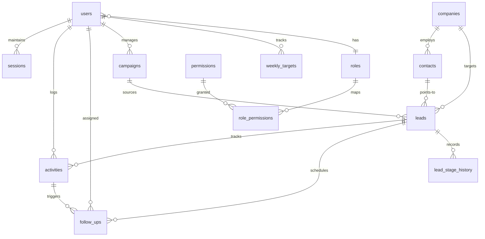

# Production Migration Log & Database Architecture (Phases 8–10)

## Executive Summary
This document provides a comprehensive technical reference for the database schema, migration history, integrity constraints, indexing strategies, and operational procedures implemented during **Phase 8 (Campaigns, Templates & Weekly Targets)**, **Phase 9 (Search Optimization & Data Quality)**, and **Phase 10 (Final Database Integrity & Production Review)** for the IT Mapping and Lead Generation Platform.

All migrations follow atomic, idempotent execution patterns utilizing SQLite with strict foreign key enforcement (`PRAGMA foreign_keys = ON;`) and comprehensive constraint checking.

---

## 1. Migrations Registry (Phases 8–10)

| Migration ID | Name | Description | Key Schema Additions |
| :--- | :--- | :--- | :--- |
| `007_campaigns_templates_reporting` | Campaigns, Templates, Reporting & Targets | Added support for structured multi-channel campaigns, outreach cadence templates, weekly user/team targets, and ATS scoring. | `campaigns`, `outreach_templates`, `weekly_targets` tables; added `campaign_id`, `referrer_name`, `referrer_contact`, `partner_name`, `referral_notes`, `ats_score` to `leads`. |
| `008_phase9_search_optimization_and_data_quality` | Search Optimization & Data Quality Integrity | Added high-performance indexes covering discovery dimensions, composite filter indexes, and normalized company lookups. | Indexes on `companies(name, industry, location, employee_size, product_fit)`, `contacts(name, email, title, decision_maker)`, `leads(product, priority, status, source)`. |
| `009_phase10_final_database_integrity_and_production_review` | Final Integrity, DNC Support & Constraints | Standardized `'Do Not Contact'` contact status, enforced lifecycle timestamp invariants (`won_at`, `lost_at`, `lost_reason`, `completed_at`), and added composite indexes & unique constraints. | Updated `contacts` table check constraint; partial unique indexes on `weekly_targets`; composite indexes on `lead_stage_history`, `activities`, and `campaigns`. |

---

## 2. Table Directory & Entity Relationships

The platform database comprises 15 relational tables:



### Table Definitions & Primary Foreign Keys

1. **`users`**
   - **PK**: `id TEXT PRIMARY KEY`
   - **FK**: `role REFERENCES roles(id) ON UPDATE CASCADE`
   - **Constraints**: `status IN ('active', 'inactive', 'suspended')`, unique email (case-insensitive).
2. **`roles`** & **`permissions`** & **`role_permissions`**
   - **Role PK**: `roles(id)`
   - **Permission PK**: `permissions(id)`
   - **Mapping PK**: `(role_id, permission_id)` with `ON DELETE CASCADE`.
3. **`sessions`**
   - **FK**: `user_id REFERENCES users(id) ON DELETE CASCADE`.
   - **Index**: `token_hash UNIQUE`.
4. **`companies`**
   - **PK**: `id TEXT PRIMARY KEY`
   - **FK**: `created_by REFERENCES users(id) ON DELETE SET NULL`
   - **Unique**: `normalized_name`, `normalized_domain`.
5. **`contacts`**
   - **PK**: `id TEXT PRIMARY KEY`
   - **FK**: `company_id REFERENCES companies(id) ON DELETE CASCADE`
   - **Constraints**: `status IN ('Active', 'Contacted', 'Qualified', 'Unresponsive', 'Do Not Contact', 'Archived')`, `decision_maker IN (0, 1)`.
6. **`leads`**
   - **PK**: `id TEXT PRIMARY KEY`
   - **FKs**:
     - `company_id REFERENCES companies(id) ON DELETE CASCADE`
     - `contact_id REFERENCES contacts(id) ON DELETE SET NULL`
     - `campaign_id REFERENCES campaigns(id) ON DELETE SET NULL`
     - `assigned_to REFERENCES users(id) ON DELETE SET NULL`
   - **Constraints**:
     - `status IN ('New', 'Contacted', 'Replied', 'Meeting Scheduled', 'Demo Booked', 'Demo Done', 'Won', 'Lost')`
     - `priority IN ('High', 'Medium', 'Low')`
     - `product IN ('Higher IQ', 'HRMS Portal', 'Both')`
7. **`lead_stage_history`**
   - **FK**: `lead_id REFERENCES leads(id) ON DELETE CASCADE`
   - **FK**: `changed_by REFERENCES users(id) ON DELETE SET NULL`
8. **`activities`**
   - **FK**: `lead_id REFERENCES leads(id) ON DELETE CASCADE`
   - **FK**: `user_id REFERENCES users(id) ON DELETE CASCADE`
   - **Constraints**: `type IN ('Email', 'LinkedIn', 'Phone', 'WhatsApp', 'Demo', 'Other')`
9. **`follow_ups`**
   - **FK**: `lead_id REFERENCES leads(id) ON DELETE CASCADE`
   - **FK**: `activity_id REFERENCES activities(id) ON DELETE SET NULL`
   - **FK**: `user_id REFERENCES users(id) ON DELETE CASCADE`
   - **FK**: `completed_by REFERENCES users(id) ON DELETE SET NULL`
   - **Constraints**: `status IN ('Pending', 'Completed', 'Cancelled')`
10. **`campaigns`**
    - **FK**: `assigned_user_id REFERENCES users(id) ON DELETE SET NULL`
    - **FK**: `created_by REFERENCES users(id) ON DELETE SET NULL`
    - **Constraints**: `status IN ('Draft', 'Active', 'Paused', 'Completed', 'Archived')`
11. **`outreach_templates`**
    - **Constraints**: `product IN ('HireIQ', 'HRMS', 'Both')`, `status IN ('Active', 'Archived')`
12. **`weekly_targets`**
    - **FK**: `user_id REFERENCES users(id) ON DELETE CASCADE`
    - **Constraints**: `target_type IN ('companies', 'contacts', 'outreach', 'replies', 'demos')`

---

## 3. Comprehensive Indexing Architecture (Phases 8–10)

### Phase 8 Indexes
- `idx_campaigns_name`, `idx_campaigns_product`, `idx_campaigns_status`, `idx_campaigns_lead_source`, `idx_campaigns_assigned_user`, `idx_campaigns_dates`
- `idx_leads_campaign_id`, `idx_leads_source`, `idx_leads_partner_name`
- `idx_templates_type`, `idx_templates_product`, `idx_templates_seq_day`, `idx_templates_status`
- `idx_weekly_targets_user`, `idx_weekly_targets_dates`, `idx_weekly_targets_type`

### Phase 9 Indexes (Search & Data Quality)
- `idx_companies_normalized_name`, `idx_companies_industry`, `idx_companies_location`, `idx_companies_employee_size`, `idx_companies_current_tools`, `idx_companies_hiring_signals`, `idx_companies_product_fit`, `idx_companies_created_at`
- `idx_companies_search_opt` on `(status, industry, product_fit, employee_size)`
- `idx_contacts_name`, `idx_contacts_email`, `idx_contacts_title`, `idx_contacts_decision_maker`, `idx_contacts_search_opt` on `(status, decision_maker, company_id)`
- `idx_leads_search_opt` on `(status, priority, product, qualification_score)`
- `idx_leads_signals_opt` on `(hiring_volume, hiring_multiple_roles, manual_hr_processes)`
- `idx_follow_ups_lead_status_due` on `(lead_id, status, due_date)`

### Phase 10 Indexes (Integrity & High-Velocity Production Aggregations)
- `idx_lead_history_lead_created` on `lead_stage_history(lead_id, created_at)`
- `idx_lead_history_to_stage` on `lead_stage_history(to_stage)`
- `idx_activities_user_date` on `activities(user_id, activity_date)`
- `idx_activities_lead_date` on `activities(lead_id, activity_date)`
- `idx_campaigns_status_product` on `campaigns(status, product)`
- `idx_templates_product_status` on `outreach_templates(product, status)`
- `idx_leads_source_status` on `leads(source, status)`
- `idx_leads_campaign_status` on `leads(campaign_id, status)`
- `idx_weekly_targets_user_dates` on `weekly_targets(user_id, start_date, end_date)`
- **Unique Partial Index**: `idx_weekly_targets_unique_user` on `(target_type, start_date, end_date, user_id) WHERE user_id IS NOT NULL`
- **Unique Partial Index**: `idx_weekly_targets_unique_global` on `(target_type, start_date, end_date) WHERE user_id IS NULL`

---

## 4. Constraint Enforcement & Business Rule Compliance

### A. "Do Not Contact" (DNC) Compliance
- When any contact is marked as `'Do Not Contact'`:
  1. All existing pending follow-ups (`status = 'Pending'`) for any leads linked to this contact are automatically transitioned to `'Cancelled'` with an audit timestamp and cancellation notes.
  2. Any future attempts to log outreach activities or schedule follow-ups for leads associated with this contact are strictly rejected with HTTP 400 and error code `DO_NOT_CONTACT_VIOLATION`.

### B. Invariant Timestamp Hygiene
- **Won Leads**: `won_at` is guaranteed to be non-null whenever `status = 'Won'`.
- **Lost Leads**: `lost_at` and `lost_reason` are guaranteed to be non-null and non-empty whenever `status = 'Lost'`.
- **Completed Follow-ups**: `completed_at` is guaranteed to be populated whenever `status = 'Completed'`.

### C. Duplicate Prevention
- **Companies**: Prevented by case-insensitive unique constraint on `normalized_name` and `normalized_domain`.
- **Leads**: Soft-duplicate detection prevents multiple active open leads for the same company and product unless explicitly overridden with `allowDuplicate: true`.
- **Weekly Targets**: Strict unique partial indexing prevents duplicate target rows for the same weekly boundary and target type for both individual sales reps and global teams.

---

## 5. Production Migration Standard Operating Procedure (SOP)

### Prerequisites
1. Ensure Node.js 22+ runtime is available.
2. Confirm `.env` contains valid production secrets (ensure `.env` is never committed to VCS).
3. Back up the active SQLite database file before executing migrations:
   ```powershell
   Copy-Item -Path "data/leads.db" -Destination "data/leads.db.backup-$(Get-Date -Format 'yyyyMMdd-HHmmss')"
   ```

### Execution Steps
1. Execute migrations and integrity checks:
   ```powershell
   npx tsx server/db/migrate.ts
   ```
2. Verify integrity output:
   - Must output: `Database integrity verified successfully.`
   - Must output: `Applied: X, Total: 9` (Applied count depends on previous state).

### Post-Migration Verification Queries
Run the following SQL queries to ensure zero anomalies:

```sql
-- 1. Database engine integrity
PRAGMA integrity_check; -- Expect: 'ok'

-- 2. Foreign key consistency check
PRAGMA foreign_key_check; -- Expect: 0 rows

-- 3. Orphan verification
SELECT COUNT(*) FROM contacts c LEFT JOIN companies co ON c.company_id = co.id WHERE co.id IS NULL; -- Expect: 0
SELECT COUNT(*) FROM leads l LEFT JOIN companies co ON l.company_id = co.id WHERE co.id IS NULL; -- Expect: 0
SELECT COUNT(*) FROM activities a LEFT JOIN leads l ON a.lead_id = l.id WHERE l.id IS NULL; -- Expect: 0
SELECT COUNT(*) FROM follow_ups f LEFT JOIN leads l ON f.lead_id = l.id WHERE l.id IS NULL; -- Expect: 0

-- 4. Invariant checks
SELECT COUNT(*) FROM leads WHERE status = 'Won' AND won_at IS NULL; -- Expect: 0
SELECT COUNT(*) FROM leads WHERE status = 'Lost' AND (lost_at IS NULL OR lost_reason IS NULL); -- Expect: 0
SELECT COUNT(*) FROM follow_ups WHERE status = 'Completed' AND completed_at IS NULL; -- Expect: 0
```

### Rollback Strategy
If any migration step encounters an unexpected error during execution:
1. SQLite transactions wrap individual migration units (`BEGIN TRANSACTION; ... COMMIT;`), ensuring automated rollback on failure.
2. If schema recovery is required, restore from the snapshot created prior to execution:
   ```powershell
   Copy-Item -Path "data/leads.db.backup-<TIMESTAMP>" -Destination "data/leads.db" -Force
   ```
